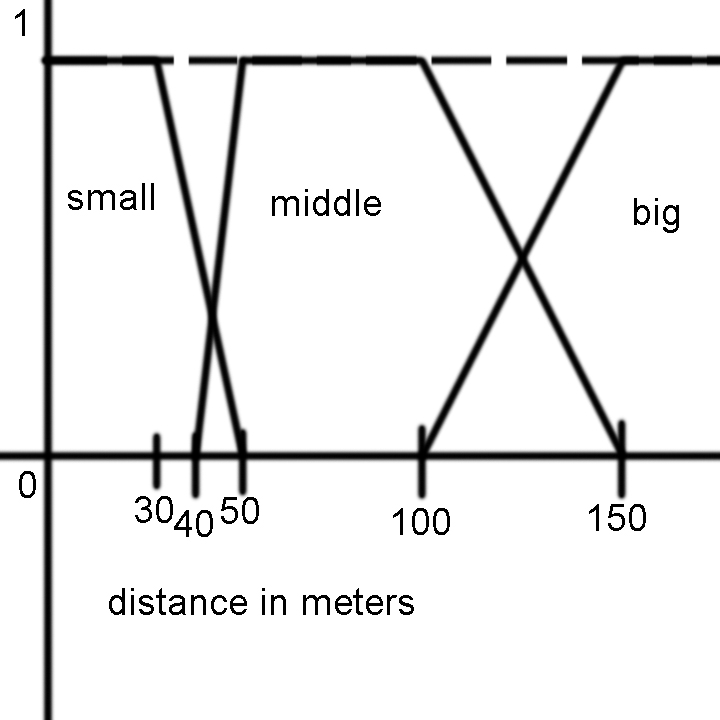
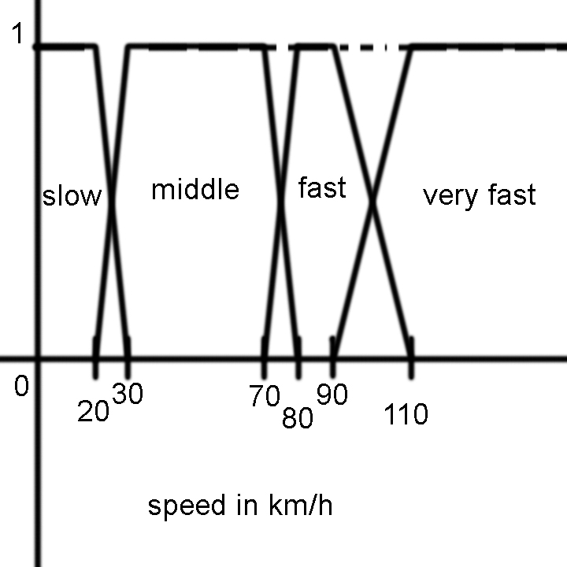
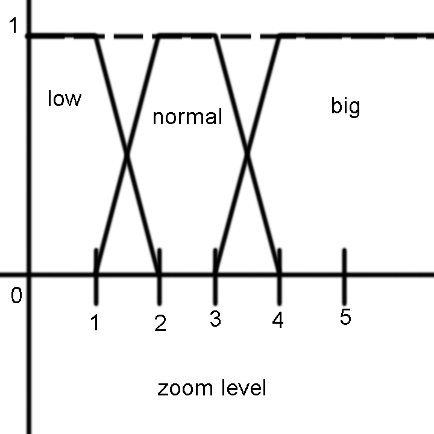
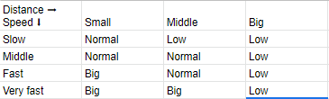

# Making a controller for the zoom of a GPS

## The program

Given the speed of a car and the distance from the closest curve calculates the desire zoom level in the GPS. This program receives the input from the user by the terminal and outputs the result.

## How it works

### The classes

- Point2D: Works as an utility to work with fuzzy sets.

- FuzzySet: Represents a fuzzy set and haves the union, intersection, multiplication, comparision and resolving methods.

- FuzzySetLeftTrapezoid, FuzzySetRightTrapezoid, FuzzySetTrapezoid and FuzzySetTrianlge: Inherit from FuzzySet and make it easier to create new fuzzy sets.

- LinguisticVariable and LinguisticValue: Describe fuzzy variables and values.

- FuzzyExpresion and NumericValue: Describes the rules of a system or a particular case.

- FuzzyRule: Defines the rules and creates them from a string. it can also create the resulting fuzzy set.

- FuzzyController: Controls the program

### The sets

Distance:

Speed:

Zoom:

### The rules

Rules:

